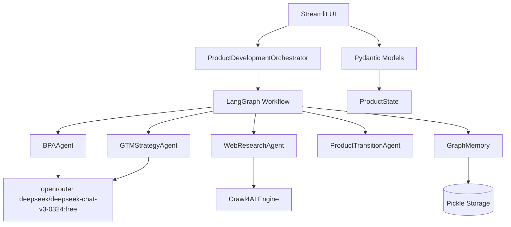

# Design Document

## Overview

The AI Strategy Assistant is a sophisticated multi-agent system that guides developers through structured business validation before coding. The system combines LangGraph for workflow orchestration, Crawl4AI for market research, Pydantic for data validation, and Streamlit for the user interface. The architecture enforces a business-first approach with validation gates to prevent "vibe coding" and ensure market-validated product development.

## Architecture

### High-Level Architecture



### System Components

1. **ProductDevelopmentOrchestrator**: Main system controller that manages the LangGraph workflow
2. **Multi-Agent System**: Specialized agents for different aspects of business analysis
3. **Data Layer**: Pydantic models ensuring type safety and validation
4. **Research Layer**: Crawl4AI integration for automated market research
5. **Presentation Layer**: Streamlit interface with interactive visualizations
6. **Memory Layer**: Persistent state management with session recovery

## Components and Interfaces

### Core Data Models

```python
# Primary state container
class ProductState(BaseModel):
    business_model: Optional[BusinessModel] = None
    target_personas: List[Dict] = []
    feature_specifications: List[FeatureSpec] = []
    gtm_strategy: Optional[GTMStrategy] = None
    competitive_analysis: List[Dict] = []
    mvp_roadmap: List[Dict] = []
    technical_architecture: Optional[Dict] = None
    market_validation: Dict[str, str] = {}
    current_phase: Literal["discovery", "validation", "planning", "mvp_design", "gtm_planning"] = "discovery"

# Business validation models
class BusinessModel(BaseModel):
    value_proposition: str = Field(..., max_length=100)
    target_customer: str
    revenue_streams: List[str] = Field(..., min_items=1)
    cost_structure: List[str] = []
    key_metrics: List[str]

class FeatureSpec(BaseModel):
    name: str
    user_story: str
    acceptance_criteria: List[str] = Field(..., min_items=3)
    mvp_priority: MVPPriority
    effort_estimate: Literal["XS", "S", "M", "L", "XL"]
    business_impact: Literal["Low", "Medium", "High", "Critical"]
    validation_level: MarketValidationLevel = MarketValidationLevel.ASSUMPTION
    dependencies: List[str] = []
```

### Agent Interfaces

```python
# Business Process Analysis Agent
class BPAAgent:
    async def analyze_business_viability(self, state: ProductState) -> ProductState
    async def _validate_problem_space(self, query: str) -> Dict
    async def _assess_solution_market_fit(self, problem_analysis: Dict) -> Dict
    async def _generate_business_model(self, solution_fit: Dict) -> BusinessModel
    async def _analyze_competitors(self, target_customer: str) -> List[Dict]
    async def _generate_mvp_features(self, business_model: BusinessModel) -> List[FeatureSpec]

# Go-to-Market Strategy Agent  
class GTMStrategyAgent:
    async def develop_gtm_strategy(self, state: ProductState) -> ProductState
    async def _identify_channels(self, business_model: BusinessModel) -> List[str]
    async def _develop_pricing(self, competitive_analysis: List[Dict]) -> str
    async def _create_launch_sequence(self, mvp_roadmap: List[Dict]) -> Dict
    async def _define_success_metrics(self, business_model: BusinessModel) -> List[str]

# Web Research Agent
class WebResearchAgent:
    async def research_topic(self, query: str, urls: List[str] = None) -> List[Dict[str, Any]]
    async def _extract_competitor_data(self, url: str) -> Dict
    async def _analyze_market_trends(self, industry: str) -> Dict
    async def _gather_pricing_intelligence(self, competitors: List[str]) -> Dict
```

### LangGraph Workflow Design

```python
class ProductDevelopmentOrchestrator:
    def _build_product_graph(self) -> StateGraph:
        workflow = StateGraph(ProductState)
        
        # Sequential workflow with validation gates
        workflow.add_node("problem_validation", self.validate_problem_node)
        workflow.add_node("business_analysis", self.business_analysis_node)
        workflow.add_node("market_research", self.market_research_node)
        workflow.add_node("mvp_planning", self.mvp_planning_node)
        workflow.add_node("technical_architecture", self.tech_architecture_node)
        workflow.add_node("gtm_strategy", self.gtm_strategy_node)
        workflow.add_node("execution_roadmap", self.execution_roadmap_node)
        workflow.add_node("rejection_report", self.rejection_report_node)
        
        # Conditional routing based on validation scores
        workflow.add_conditional_edges(
            "problem_validation",
            self._should_continue_development,
            {"continue": "business_analysis", "stop": "rejection_report"}
        )
        
        return workflow.compile()
```

## Data Models

### State Management

The system uses a centralized `ProductState` model that flows through the entire LangGraph workflow. This ensures consistency and enables proper state transitions between agents.

**Key State Transitions:**
- `discovery` → `validation` (after problem validation)
- `validation` → `planning` (after business analysis)
- `planning` → `mvp_design` (after market research)
- `mvp_design` → `gtm_planning` (after MVP planning)

### Data Validation Strategy

All data inputs and outputs are validated using Pydantic models with custom validators:

```python
class BusinessModel(BaseModel):
    value_proposition: str = Field(..., description="Clear value prop in one sentence")
    
    @validator('value_proposition')
    def validate_value_prop(cls, v):
        if len(v.split()) > 20:
            raise ValueError('Value proposition must be concise (max 20 words)')
        return v

class FeatureSpec(BaseModel):
    acceptance_criteria: List[str] = Field(..., min_items=3)
    
    @validator('acceptance_criteria')
    def validate_criteria(cls, v):
        for criterion in v:
            if not any(keyword in criterion.upper() for keyword in ['WHEN', 'THEN', 'SHALL', 'IF']):
                raise ValueError('Acceptance criteria must follow EARS format')
        return v
```

### Memory Architecture

```python
class GraphMemory:
    def __init__(self, memory_path: str = "graph_memory.pkl"):
        self.memory_path = memory_path
        self.memory = self._load_memory()
    
    def save_session(self, session_id: str, state: ProductState):
        """Persist session state with versioning"""
        session_data = {
            'state': state.dict(),
            'timestamp': datetime.now(),
            'version': '1.0'
        }
        self.memory[session_id] = session_data
        self._persist_memory()
    
    def load_session(self, session_id: str) -> Optional[ProductState]:
        """Load session with backward compatibility"""
        if session_id in self.memory:
            session_data = self.memory[session_id]
            return ProductState(**session_data['state'])
        return None
```

## Error Handling

### Validation Gates

The system implements business validation gates that prevent progression without meeting quality thresholds:

```python
def _should_continue_development(self, state: ProductState) -> str:
    """Business gate: Only continue if problem is worth solving"""
    problem_score = self._extract_problem_score(state.market_validation)
    
    if problem_score < 7:
        return "stop"  # Route to rejection report
    
    return "continue"  # Proceed to business analysis
```

### Error Recovery

Each agent implements graceful error handling:

```python
async def research_node(self, state: ProductState) -> ProductState:
    try:
        async with WebResearchAgent() as research_agent:
            research_data = await research_agent.research_topic(
                query=state.user_query,
                urls=self._generate_research_urls(state.business_model)
            )
            state.research_data = research_data
    except Exception as e:
        # Log error but continue with limited data
        logger.error(f"Research failed: {e}")
        state.research_data = [{"error": str(e), "fallback": True}]
    
    return state
```

### Data Integrity

Pydantic validation ensures data integrity at every step:

```python
def validate_feature_spec(self, feature_data: Dict) -> FeatureSpec:
    try:
        return FeatureSpec(**feature_data)
    except ValidationError as e:
        # Provide specific feedback on validation failures
        raise ValueError(f"Feature specification invalid: {e.errors()}")
```

## Testing Strategy

### Unit Testing

Each agent and component will have comprehensive unit tests:

```python
class TestBPAAgent:
    async def test_validate_problem_space(self):
        agent = BPAAgent(mock_llm)
        result = await agent._validate_problem_space("Test problem")
        assert "analysis" in result
        assert "timestamp" in result
    
    async def test_generate_mvp_features(self):
        business_model = BusinessModel(
            value_proposition="Test value prop",
            target_customer="Test customer",
            revenue_streams=["subscription"],
            key_metrics=["MRR"]
        )
        features = await agent._generate_mvp_features(business_model)
        assert len(features) >= 5
        assert len(features) <= 8
        core_features = [f for f in features if f.mvp_priority == MVPPriority.CORE]
        assert len(core_features) <= 3
```

### Integration Testing

LangGraph workflow testing:

```python
class TestWorkflowIntegration:
    async def test_complete_workflow(self):
        orchestrator = ProductDevelopmentOrchestrator()
        initial_state = ProductState(user_query="Build an e-commerce platform")
        
        result = await orchestrator.graph.ainvoke(initial_state)
        
        assert result.business_model is not None
        assert len(result.feature_specifications) > 0
        assert result.gtm_strategy is not None
        assert result.current_phase == "gtm_planning"
```

### UI Testing

Streamlit interface testing using pytest and selenium:

```python
class TestStreamlitUI:
    def test_business_validation_form(self):
        # Test form rendering and validation
        pass
    
    def test_impact_effort_matrix(self):
        # Test visualization generation
        pass
    
    def test_session_persistence(self):
        # Test memory functionality
        pass
```

### Performance Testing

Load testing for concurrent users and large datasets:

```python
class TestPerformance:
    async def test_concurrent_sessions(self):
        # Test multiple simultaneous workflows
        pass
    
    async def test_large_research_dataset(self):
        # Test handling of extensive web crawling results
        pass
```

This design provides a robust, scalable architecture that enforces business-first thinking while maintaining technical excellence through proper separation of concerns, comprehensive error handling, and thorough testing strategies.