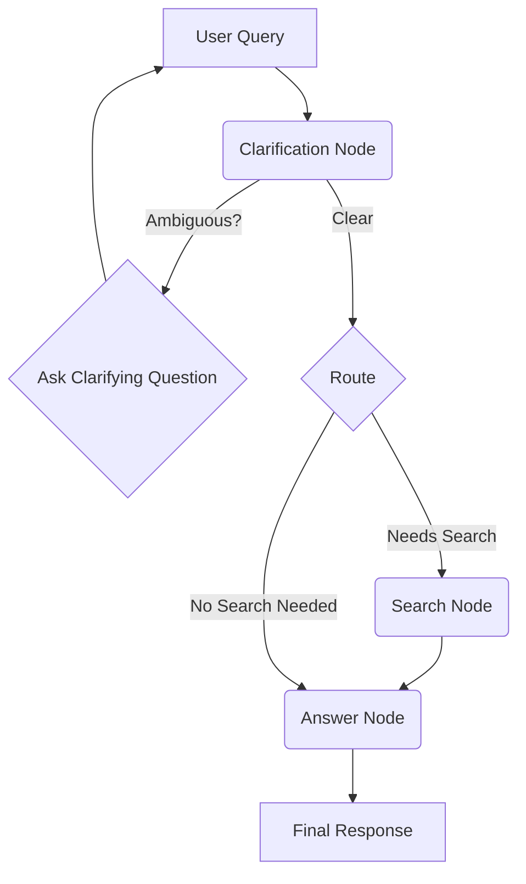

# Clarification Agent - Architecture

## Overview

The Clarification Agent is built on a modular, graph-based architecture using LangGraph. This design allows for a clear and extensible flow of conversation, where each step is a distinct node in the graph. The agent's primary goal is to understand and clarify user queries before providing a final, well-informed answer.

## Core Components

The architecture is centered around a few key concepts:

1.  **LangGraph Graph**: The core of the agent is a `LangGraph` instance that defines the conversational flow. It orchestrates the execution of different nodes based on the current state of the conversation.

2.  **State Object**: A central `TypedDict` state object is passed between nodes. It maintains the entire context of the conversation, including:
    - `messages`: A list of all messages in the conversation.
    - `context`: A dictionary to store intermediate data like clarification status, search results, and user intent.

3.  **Nodes**: These are the building blocks of the agent's logic. Each node is a Python function or callable that performs a specific task. The MVP includes:
    - `clarification_node`: Analyzes the user's latest query to determine if it's ambiguous. If so, it formulates a clarifying question.
    - `search_node`: When a query requires external information, this node uses tools like `ccrawl4ai` for local document search or other web search utilities to find relevant data.
    - `answer_node`: Once the user's intent is clear (and any necessary information has been retrieved), this node generates the final response.

4.  **Edges**: These connect the nodes and define the possible paths the conversation can take.
    - **Conditional Edges**: The most critical part of the routing logic. After the `clarification_node`, a conditional edge decides the next step based on the node's output.
    - **Standard Edges**: Direct connections, such as from the `search_node` to the `answer_node`.

## High-Level Flow

